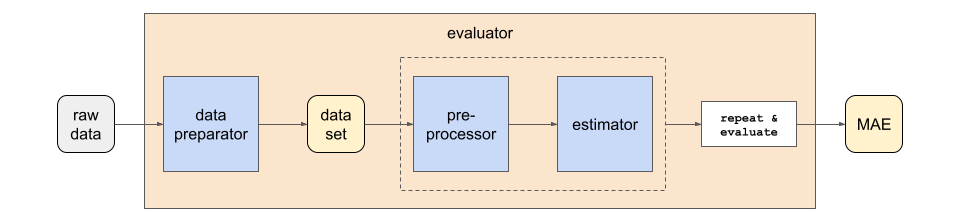

Architecture
============

In this mini-project, we will build an extensible and fully reproducible system
to analyze multiple datasets, with various Machine Learning techniques.

Functional Overview
-------------------
The system is a straightforward machine learning pipeline: it takes a dataset,
trains a model and evaluates its `Mean Absolute Error (MAE) <https://en.wikipedia.org/wiki/Mean_absolute_error>`_.

.. image:: img/functional-overview.png   
   :alt: functional overview

Evaluator
---------
The `Evaluator <apidoc/src.evaluator.html#src.evaluator.Evaluator>`_
is an orchestrator that takes
a `Preparator <apidoc/src.preparator.contract.html#src.preparator.contract.Preparator>`_,
a `Preprocessor <apidoc/src.preprocessing.contract.html#src.preprocessing.contract.Preprocessor>`_
and an `Estimator <apidoc/src.estimating.contract.html#src.estimating.contract.Estimator>`_
and returns their `MAE <https://en.wikipedia.org/wiki/Mean_absolute_error>`_.

It has the advantage of being easily customizable, as the `injected dependencies <https://en.wikipedia.org/wiki/Dependency_injection>`_
(aka the "blue blocks") can be easily swapped.
However, it can be somewhat complex to initialize.

Service
-------

To help with the initialization of the `Evaluator`, we provide a `Service <apidoc/src.service.html#src.service.Service>`_, that is
extremely easy to use (``Service().run()``) and can be used as an entry point.

Behind the scenes, `Service <apidoc/src.service.html#src.service.Service>`_ ensures the initialization of
an  `Evaluator <apidoc/src.evaluator.html#src.evaluator.Evaluator>`_, via `factories <https://en.wikipedia.org/wiki/Factory_method_pattern>`_ 

NB: the above diagram shows the interactions of the following classes:

- `ArgParser <apidoc/src.arg_parser.html#src.arg_parser.ArgParser>`_
- `PreparatorFactory <apidoc/src.preparator.factory.html#src.preparator.factory.PreparatorFactory>`_
- `EstimatorFactory <apidoc/src.estimating.factory.html#src.estimating.factory.EstimatorFactory>`_
- `PreprocessorFactory <apidoc/src.preprocessing.factory.html#src.preprocessing.factory.PreprocessorFactory>`_
